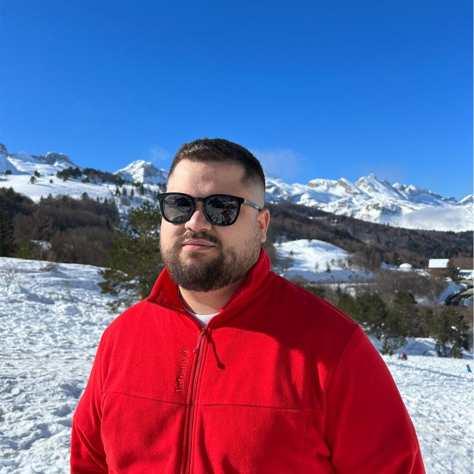

## Short Bio

::: {.grid}

::: {.g-col-12 .g-col-md-4}
{.rounded fig-align="center" width="100%"}
:::

::: {.g-col-12 .g-col-md-8}
I am a **postdoctoral researcher** at the Spanish National Research Council
(CSIC), based at the [Desertification Research Centre (CIDE, CSIC-UV-GVA)](https://www.uv.es/uvweb/desertification-research-centre/en/desertification-research-centre-1285894590702.html)
in Valencia, where I work within the **DOWNBURST** project on the detection,
physical processes, and climate change attribution of extreme convective wind
gusts. From September 2026 I will continue at CIDE as a **Juan de la Cierva
Postdoctoral Fellow** (JDC2024-055355-I).

My research focuses on **severe convection** and its links to **climate change** —
supercells, hail, convectively-driven extreme wind gusts, and tropical-like
cyclones over the North Atlantic and the Mediterranean. I combine
convection-permitting numerical simulations (HARMONIE-AROME, WRF-ARW),
reanalysis-based ingredients diagnostics, and pseudo-global warming experiments
to quantify how anthropogenic climate change is reshaping high-impact convective
weather.

I hold an **International PhD in Physics — Meteorology** from the University
of Valladolid (October 2024), funded by an FPI fellowship from the Spanish
Ministry of Science. I am co-founder of the [Spanish Supercell and Hail citizen
science project](https://twitter.com/Supercelulas), which collects reports of
supercells and large hail across Spain to bridge observational gaps and study
how severe storm dynamics are evolving in a warming world.
:::

:::

## Research Interests

- Severe convection: supercells, large hail, convective wind gusts
- Climate change attribution of high-impact weather events
- Tropical and subtropical transitions in the North Atlantic
- Mediterranean cyclones and Medicanes
- Convection-permitting numerical weather prediction (HARMONIE-AROME, WRF)
- Pseudo-global warming methodologies
- Citizen science for severe weather observations

## Current Position

**Postdoctoral Researcher** · *since September 2025*  
Centro de Investigaciones sobre Desertificación (CIDE, CSIC-UV-GVA), Valencia, Spain  
DOWNBURST project — PROMETEO Grant CIPROM/2023/38 (Generalitat Valenciana)

**Juan de la Cierva Postdoctoral Fellow** · *from September 2026*  
Spanish Ministry of Science (Ref: JDC2024-055355-I)

## Previous Positions

| Period | Position | Institution |
| --- | --- | --- |
| Oct 2024 – Aug 2025 | FPI Postdoctoral Researcher (POP stage) | Univ. of Valladolid — Dept. of Applied Mathematics, Segovia |
| Sep 2021 – Oct 2024 | FPI Predoctoral Researcher | Univ. of Valladolid — Dept. of Applied Mathematics, Segovia |
| Feb 2020 – May 2020 | Intern | AEMET — Cataluña delegation, Barcelona |

### Research Stays

| Period | Centre | Topic |
| --- | --- | --- |
| Mar – Apr 2026 | Servicio Meteorológico Nacional (SMN), Buenos Aires, Argentina | Downburst detection algorithms in radar data |
| Dec 2025 – Mar 2026 | Instituto Pirenaico de Ecología (IPE-CSIC), Zaragoza | Climate change attribution of the 2024 Valencia floods |
| Nov 2024 – Feb 2025 | Centro de Investigaciones sobre Desertificación (CIDE-CSIC), Valencia | Climate change attribution of the 2024 Valencia floods |
| Sep – Dec 2023 | National Center for Atmospheric Research (NCAR), Boulder, CO, USA | Secondary circulation in the tropical transition of Hurricane Ophelia |
| Dec 2022 – Feb 2023 | Agencia Estatal de Meteorología (AEMET), Madrid | Sub-km HARMONIE-AROME simulations |

## Education

**International PhD in Physics — Meteorology** · University of Valladolid · 2024  
*Thesis on tropical transitions in the North Atlantic and numerical modelling.*

**MSc in Geographic Information Systems and Remote Sensing** · University of Zaragoza · 2021

**MSc in Meteorology** · University of Barcelona · 2020

**BSc in Geography and Spatial Planning** · University of Zaragoza · 2019

## Teaching & Supervision

### University Teaching

Approximately **90 hours** of teaching practice at the University of Valladolid
— Campus María Zambrano (Segovia, Spain).

- *Estadística, Sistemas de Información y Nuevas Tecnologías* — Academic years 2023/24, 2024/25
- *Cálculo de Probabilidades y Estadística* — Academic years 2022/23, 2023/24, 2024/25

### PhD Supervision

- **Pablo Gómez-Plasencia** — *Tropical cyclones from tropical transitions impacting the North Atlantic: dynamic analysis and risk evaluation under future climate*. Co-supervised with Dr. J. J. González-Alemán & Dra. M. L. Martín. Ongoing — expected defence 2027.
- **PhD student to be hired** under the Santiago Grisolia fellowship. Co-supervised with Dr. César Azorín-Molina. Expected start October 2026.

### MSc Supervision

- **U. Intxausti Montoro** — *Análisis del papel de la orografía en las inundaciones asociadas a la DANA del 29 de octubre de 2024*. Co-supervised with Dr. M. Sastre Marugan & Dra. M. L. Martín. Expected defence June 2026.

## Languages

Spanish (native) · English (full professional proficiency) · Italian (basic)

## Memberships

- Spanish Climatological Society (AEC) — *since 2015*
- European Geosciences Union (EGU) — *since 2018*
- American Geophysical Union (AGU) — *since 2023*
- Spanish Meteorological Association (AME) — *since 2025*

## Contact

[carlos.calvo@csic.es](mailto:carlos.calvo@csic.es) · CIDE-CSIC, Ctra. Moncada-Náquera km 4.5, 46113 Moncada (Valencia), Spain

You can also reach me through any of the social links at the bottom of this page.

---

*Last updated: April 2026.* [Download CV (PDF)](files/CarlosCalvoSancho_CV.pdf)
