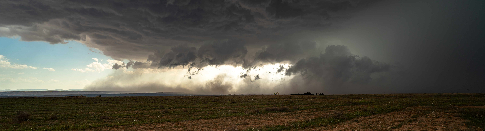

My research focuses on **severe convection** and its links to **climate change** —
supercells, hail, convectively-driven extreme wind gusts, and tropical-like
cyclones over the North Atlantic and the Mediterranean. I combine
convection-permitting numerical simulations (HARMONIE-AROME, WRF), reanalysis-based
ingredients diagnostics, and pseudo-global warming experiments to quantify how
anthropogenic climate change is reshaping high-impact convective weather.

::: {.grid}

::: {.g-col-4 .text-center}
### 16
*peer-reviewed articles*
:::

::: {.g-col-4 .text-center}
### 6
*as first author*
:::

::: {.g-col-4 .text-center}
### 160+
*citations (Scholar)*
:::

:::

[ Google Scholar](https://scholar.google.com/citations?user=UHzcEtEAAAAJ)
&nbsp;&nbsp;
[ ORCID](https://orcid.org/0000-0003-2457-9793)
&nbsp;&nbsp;
[ ResearchGate](https://www.researchgate.net/profile/Carlos-Calvo-Sancho)
&nbsp;&nbsp;
[Scopus](https://www.scopus.com/authid/detail.uri?authorId=57435464300)
&nbsp;&nbsp;
[Web of Science](https://www.webofscience.com/wos/author/record/OUI-9468-2025)

---

## Peer-Reviewed Journal Articles

::: {.callout-note appearance="minimal"}
Names in **bold** indicate first or corresponding authorship.  
Click the Altmetric donut to see media coverage and online attention for each paper.
:::

1. **Calvo-Sancho, C.**, Díaz-Fernández, J., González-Alemán, J. J., Halifa-Marín, A., Miglietta, M. M., Azorín-Molina, C., Prein, A. F., Montoro-Mendoza, A., Bolgiani, P., Morata, A., & Martín, M. L. (2026). "Human-induced climate change amplification on storm dynamics in Valencia's 2024 catastrophic flash flood" *Nature Communications*, 17, 1492. DOI: [10.1038/s41467-026-68929-9](https://doi.org/10.1038/s41467-026-68929-9)

   

   [DOI](https://doi.org/10.1038/s41467-026-68929-9){.btn .btn-outline-primary .btn-sm role="button"}
   

   

2. Montoro-Mendoza, A., **Calvo-Sancho, C.**, González-Alemán, J. J., Díaz-Fernández, J., Bolgiani, P., & Martín, M. L. (2026). "Strengthening of favorable environments for North Atlantic tropical cyclogenesis in midlatitudes in a warmer climate" *npj Climate and Atmospheric Science*, 9, 45. DOI: [10.1038/s41612-025-01317-0](https://doi.org/10.1038/s41612-025-01317-0)

   

   [DOI](https://doi.org/10.1038/s41612-025-01317-0){.btn .btn-outline-primary .btn-sm role="button"}
   

   

3. Díaz-Fernández, J., **Calvo-Sancho, C.**, López-Reyes, M., Bolgiani, P., González-Alemán, J. J., Morata, A., Santos-Muñoz, D., & Martín, M. L. (2026). "Cost-benefit analysis of the nesting approach in HARMONIE-AROME for a supercell outbreak case study" *Atmospheric Research*, 334, 108774. DOI: [10.1016/j.atmosres.2026.108774](https://doi.org/10.1016/j.atmosres.2026.108774)

   

   [DOI](https://doi.org/10.1016/j.atmosres.2026.108774){.btn .btn-outline-primary .btn-sm role="button"}
   

   

4. López-Reyes, M., Martín, M. L., **Calvo-Sancho, C.**, & González-Alemán, J. J. (2026). "Dynamic forcing behind Hurricane Lidia's rapid intensification" *Weather and Climate Dynamics*, 7, 523–545. DOI: [10.5194/wcd-7-523-2026](https://doi.org/10.5194/wcd-7-523-2026)

   

   [DOI](https://doi.org/10.5194/wcd-7-523-2026){.btn .btn-outline-primary .btn-sm role="button"}
   

   

5. Díaz-Fernández, J., **Calvo-Sancho, C.**, Bolgiani, P., Sastre, M., López-Reyes, M., Fernández-González, S., & Martín, M. L. (2025). "Effect of complex orography on numerical simulations of a downburst event in Spain" *Atmospheric Research*, 314, 107821. DOI: [10.1016/j.atmosres.2024.107821](https://doi.org/10.1016/j.atmosres.2024.107821)

   

   [DOI](https://doi.org/10.1016/j.atmosres.2024.107821){.btn .btn-outline-primary .btn-sm role="button"}
   

   

6. Pantillon, F., Davolio, S., Avolio, E., **Calvo-Sancho, C.**, Carrió, D. S., Dafis, S., Flaounas, E., Gentile, E. S., González-Alemán, J. J., Gray, S., Miglietta, M. M., Patlakas, P., Pytharoulis, I., Ricard, D., Ricchi, A., & Sanchez, C. (2024). "The crucial representation of deep convection for the cyclogenesis of Medicane Ianos" *Weather and Climate Dynamics*, 5, 1187–1205. DOI: [10.5194/wcd-5-1187-2024](https://doi.org/10.5194/wcd-5-1187-2024)

   

   [DOI](https://doi.org/10.5194/wcd-5-1187-2024){.btn .btn-outline-primary .btn-sm role="button"}
   

   

7. Montoro-Mendoza, A., **Calvo-Sancho, C.**, González-Alemán, J. J., Díaz-Fernández, J., Bolgiani, P., Sastre, M., Moreno-Chamarro, E., & Martín, M. L. (2024). "Environments conductive to tropical transitions in the North Atlantic: Anthropogenic climate change influence study" *Atmospheric Research*, 310, 107609. DOI: [10.1016/j.atmosres.2024.107609](https://doi.org/10.1016/j.atmosres.2024.107609)

   

   [DOI](https://doi.org/10.1016/j.atmosres.2024.107609){.btn .btn-outline-primary .btn-sm role="button"}
   

   

8. López-Reyes, M., González-Alemán, J. J., **Calvo-Sancho, C.**, Bolgiani, P., Sastre, M., & Martín, M. L. (2024). "Remote interactions between tropical cyclones: The case of Hurricane Michael and Leslie's high predictability uncertainty" *Atmospheric Research*, 311, 107697. DOI: [10.1016/j.atmosres.2024.107697](https://doi.org/10.1016/j.atmosres.2024.107697)

   

   [DOI](https://doi.org/10.1016/j.atmosres.2024.107697){.btn .btn-outline-primary .btn-sm role="button"}
   

   

9. Martín, M. L., **Calvo-Sancho, C.**, Taszarek, M., González-Alemán, J. J., Montoro-Mendoza, A., Díaz-Fernández, J., Bolgiani, P., Sastre, M., & Martín, Y. (2024). "Major role of marine heatwave and anthropogenic climate change on a giant hail event in Spain" *Geophysical Research Letters*, 51(6), e2023GL107632. DOI: [10.1029/2023GL107632](https://doi.org/10.1029/2023GL107632)

   

   [DOI](https://doi.org/10.1029/2023GL107632){.btn .btn-outline-primary .btn-sm role="button"}
   

   

10. Díaz-Fernández, J., **Calvo-Sancho, C.**, Bolgiani, P., González-Alemán, J. J., Farrán, J. I., Sastre, M., & Martín, M. L. (2024). "On the precursor environments to mountain lee wave clouds in central Iberia under CMIP6 projections" *Atmosphere*, 15(1), 128. DOI: [10.3390/atmos15010128](https://doi.org/10.3390/atmos15010128)

    

    [DOI](https://doi.org/10.3390/atmos15010128){.btn .btn-outline-primary .btn-sm role="button"}
    

    

11. **Calvo-Sancho, C.**, Quitián-Hernández, L., González-Alemán, J. J., Bolgiani, P., Santos-Muñoz, D., & Martín, M. L. (2023). "Assessing the performance of the HARMONIE-AROME and WRF-ARW numerical models in North Atlantic tropical transitions" *Atmospheric Research*, 291, 106801. DOI: [10.1016/j.atmosres.2023.106801](https://doi.org/10.1016/j.atmosres.2023.106801)

    

    [DOI](https://doi.org/10.1016/j.atmosres.2023.106801){.btn .btn-outline-primary .btn-sm role="button"}
    

    

12. **Calvo-Sancho, C.**, Quitián-Hernández, L., Bolgiani, P., González-Alemán, J. J., Santos-Muñoz, D., & Martín, M. L. (2023). "Assessment of HARMONIE-AROME in the simulation of the convective activity associated to a subtropical transition using satellite data" *Atmospheric Research*, 290, 106794. DOI: [10.1016/j.atmosres.2023.106794](https://doi.org/10.1016/j.atmosres.2023.106794)

    

    [DOI](https://doi.org/10.1016/j.atmosres.2023.106794){.btn .btn-outline-primary .btn-sm role="button"}
    

    

13. **Calvo-Sancho, C.**, Bolgiani, P., Subias, A., Sastre, M., González-Alemán, J. J., & Martín, M. L. (2023). "Horizontal kinetic energy analysis of tropical transition simulations with the WRF and HARMONIE-AROME models" *Quarterly Journal of the Royal Meteorological Society*, 149(756), 2655–2677. DOI: [10.1002/qj.4523](https://doi.org/10.1002/qj.4523)

    

    [DOI](https://doi.org/10.1002/qj.4523){.btn .btn-outline-primary .btn-sm role="button"}
    

    

14. **Calvo-Sancho, C.**, Díaz-Fernández, J., Martín, Y., Bolgiani, P., Sastre, M., González-Alemán, J. J., Santos-Muñoz, D., Farrán, J. I., & Martín, M. L. (2022). "Supercell convective environments in Spain based on ERA5: hail and non-hail differences" *Weather and Climate Dynamics*, 3(3), 1021–1036. DOI: [10.5194/wcd-3-1021-2022](https://doi.org/10.5194/wcd-3-1021-2022)

    

    [DOI](https://doi.org/10.5194/wcd-3-1021-2022){.btn .btn-outline-primary .btn-sm role="button"}
    

    

15. **Calvo-Sancho, C.**, González-Alemán, J. J., Bolgiani, P., Santos-Muñoz, D., Farrán, J. I., & Martín, M. L. (2022). "An environmental synoptic analysis of tropical transitions in the central and Eastern North Atlantic" *Atmospheric Research*, 278, 106353. DOI: [10.1016/j.atmosres.2022.106353](https://doi.org/10.1016/j.atmosres.2022.106353)

    

    [DOI](https://doi.org/10.1016/j.atmosres.2022.106353){.btn .btn-outline-primary .btn-sm role="button"}
    

    

16. Bolgiani, P., **Calvo-Sancho, C.**, Díaz-Fernández, J., Quitián-Hernández, L., Sastre, M., Santos-Muñoz, D., Farrán, J. I., González-Alemán, J. J., Valero, F., & Martín, M. L. (2022). "Wind kinetic energy climatology and effective resolution for the ERA5 reanalysis" *Climate Dynamics*, 59(3-4), 737–752. DOI: [10.1007/s00382-022-06154-y](https://doi.org/10.1007/s00382-022-06154-y)

    

    [DOI](https://doi.org/10.1007/s00382-022-06154-y){.btn .btn-outline-primary .btn-sm role="button"}
    

    

### Book Chapters & Proceedings

- **Calvo-Sancho, C.**, Rotunno, R., Montoro-Mendoza, A., González-Alemán, J. J., López-Reyes, M., & Martín, M. L. (2025). "Evolución del calentamiento en la transición tropical del huracán Ophelia." In Luna, M. Y. & González-Rouco, F. (Eds.), *Cambio climático y sociedad: de la ciencia básica a los servicios climáticos*, AEC & AEMET, pp. 67–74.

- Díaz-Fernández, J., **Calvo-Sancho, C.**, Bolgiani, P., Farrán Martín, J. I., Luna Rico, Y., & Martín, M. L. (2025). "Proyecciones futuras de los precursores de ondas de montaña en la sierra de Guadarrama utilizando modelos climáticos de CMIP6." In Luna, M. Y. & González-Rouco, F. (Eds.), *Cambio climático y sociedad: de la ciencia básica a los servicios climáticos*, AEC & AEMET, pp. 9–20.

- **Calvo-Sancho, C.**, González-Alemán, J. J., Luna, M. Y., Bolgiani, P., et al. (2022). "Identificación y distribución temporal de transiciones tropicales en el Océano Atlántico Norte." In Martí Ezpeleta, A. et al. (Eds.), *Retos del cambio climático: impactos, mitigación y adaptación*, AEC & AEMET, pp. 423–431.

---

## Research Projects

### As Principal Investigator

- **SPESSANC** — Severe Convective Storms in the Euro-Mediterranean Region. ECMWF Special Project. **2026–2029**. CIDE, CSIC-UV-GVA.

### As Team Member

- **CONSCIENCE** — Tropical cyclones impacting the Eastern North Atlantic: dynamic and risk analysis under future climate (PID2023-146344OB-I00). Spanish Research Agency. PI: Dr. María Luisa Martín & Dr. Íñigo Gómara. 2024–2027. €145,000.
- **DOWNBURST** — Potential effects of anthropogenic climate warming on wind storm hazards (PROMETEO CIPROM/2023/38). Generalitat Valenciana — Excellence Research Groups. PI: Dr. César Azorín-Molina. 2024–2028. €600,000.
- **RED-CLIMA 2** — Spanish and Ibero-American network on climate variability and climate services (LINCG24042). LINCGLOBAL — CSIC. PI: Dr. César Azorín-Molina. 2024–2026. €37,500.
- **MEDCYCLONES** — European network for Mediterranean cyclones in weather and climate. COST Action — European Commission. PIs: Dr. E. Flaounas (ETH Zurich) & Dr. S. Davolio (Univ. di Milano). 2020–2024. €576,000.
- **IBERCANES** — North Atlantic tropical-transition cyclones and the potential threat to Iberia (PID2019-105306RB-I00). Spanish Research Agency. PI: Dr. María Luisa Martín. 2020–2024. €90,000.

---

## Talks & Presentations

### Invited Lectures & Seminars

**Human-induced climate change amplification on storm dynamics in Valencia's 2024 catastrophic flash flood** Invited  
*Servicio Meteorológico Nacional (SMN)*, Buenos Aires, Argentina · Mar 2026

**¿Está el cambio climático reforzando los eventos extremos en España? Granizo gigante de Girona 2022 e inundaciones de València 2024** Invited  
*Ciclo de Coloquios DCAO, Universidad de Buenos Aires*, Argentina · Mar 2026

**Human-induced climate change amplification on storm dynamics in Valencia's 2024 catastrophic flash flood** Invited  
*Universidad de León*, Spain · Mar 2026

**Human-induced climate change amplification on storm dynamics in Valencia's 2024 catastrophic flash flood** Invited  
*Seminarios Científico-Técnicos CIDE-CSIC*, Moncada, Valencia, Spain · Feb 2026

**¿Está el cambio climático reforzando los eventos extremos en España?** Invited  
*Charlas del IPE-CSIC*, Zaragoza, Spain · Feb 2026

**¿Está el cambio climático reforzando los eventos extremos en España?** Invited  
*XXXI Jornades de Meteorologia Eduard Fontserè*, Institut d'Estudis Catalans, Barcelona, Spain · Nov 2025

**Storm dynamics-based attribution to the Valencia's deadly floods** Invited  
*Master en Meteorología y Geofísica, Universidad Complutense de Madrid*, Spain · Nov 2025

**Storm dynamics-based attribution to the Valencia's deadly floods** Invited  
*Master en Meteorología, Universitat de Barcelona*, Spain · May 2025

### Conference Presentations

**41 contributed presentations** at international and national conferences (32 international + 9 national), including 17 oral presentations (2 solicited at EGU 2025 and AEC 2025) and 9 posters as presenter.

Selected venues: *5th Workshop on Convective Organization* (Brazil, 2026), *EGU General Assembly* (2020–2025), *EMS Annual Meeting* (2024–2025), *European Conference on Severe Storms* (2023, 2025), *AGU Fall Meeting* (2023), *AEC Congress*, *AME Jornadas Científicas*, *MedCyclones Workshop*.

Full list available in the [CV](files/CarlosCalvoSancho_CV.pdf).

---

## Awards

- **First Prize — Scientific Photography**, EGU General Assembly 2025, Vienna, Austria · May 2025
- **Young Award for Best Contribution**, Spanish Climatology Society (AEC 2025), San Lorenzo del Escorial, Spain · Jan 2025
- **Young Scientist Conference Award (YSCA)**, European Meteorological Society — 11th European Conference on Severe Storms · May 2023
- **Young Award for Best Contribution**, Spanish Climatology Society (AEC 2022), Santiago de Compostela, Spain · Oct 2022

---

## Fellowships & Stays

### Fellowships

- **Juan de la Cierva Postdoctoral Fellowship** (Sep 2026 – Aug 2028) — Spanish Ministry of Science (Ref: JDC2024-055355-I)
- **FPI Predoctoral Fellowship** (Sep 2021 – Aug 2025) — Spanish Ministry of Science and Innovation. ~€100,000

### Research Stays

- **Servicio Meteorológico Nacional (SMN)**, Buenos Aires, Argentina (Mar–Apr 2026, 1.5 months) — Host: Mercedes Poggi. Topic: downburst detection algorithms in radar data
- **Instituto Pirenaico de Ecología (IPE-CSIC)**, Zaragoza, Spain (Dec 2025–Mar 2026, 3 months) — Host: Dr. César Azorín-Molina. Topic: climate change attribution of the 2024 Valencia floods
- **Centro de Investigaciones sobre Desertificación (CIDE, CSIC-UV-GVA)**, Moncada, Spain (Nov 2024–Feb 2025, 4 months) — Host: Dr. César Azorín-Molina. Topic: climate change attribution of the 2024 Valencia floods
- **National Center for Atmospheric Research (NCAR)**, Boulder, CO, USA (Sep–Dec 2023, 3 months) — Host: Dr. Richard Rotunno. Topic: secondary circulation in the tropical transition of Hurricane Ophelia
- **Agencia Estatal de Meteorología (AEMET)**, Madrid, Spain (Dec 2022–Feb 2023, 3 months) — Host: Dra. Yolanda Luna Rico. Topic: sub-km HARMONIE-AROME simulations

---

## Peer Review

Reviewer for the following journals:

- *Nature Communications* (since 2025)
- *Atmospheric Research* (since 2023)
- *Weather and Climate Dynamics* (since 2024)
- *Quarterly Journal of the Royal Meteorological Society* (since 2024)
- *Weather and Climate Extremes* (since 2025)
- *Frontiers in Marine Science* (since 2025)
- *Scientific Data* (since 2025)

---

## Spanish Supercell & Hail Project {#supercelulas}
{fig-align="center"}

Co-founder of the **Spanish Supercell and Hail citizen science project**, which
collects reports of supercells and large hail (≥ 5 cm) across Spain via social media
on [@Supercelulas](https://twitter.com/Supercelulas) (X) and
[@supercelulas.bsky.social](https://bsky.app/profile/supercelulas.bsky.social)
(Bluesky).

The project bridges observational gaps to assess how climate change is shaping the
frequency and intensity of severe convective events, supporting research on
convective climatology, storm ingredients, and climate change attribution of extreme
convection in the Western Mediterranean.

[X / Twitter](https://twitter.com/Supercelulas){.btn .btn-outline-primary}
[Bluesky](https://bsky.app/profile/supercelulas.bsky.social){.btn .btn-outline-secondary}

---

## Media Coverage

The 2026 *Nature Communications* attribution study on the Valencia DANA flash
flood received broad national and international coverage.

### International press

- **Bloomberg** — [Climate Change Made Deadly Valencia Floods More Intense](https://www.bloomberg.com/news/articles/2026-02-17/climate-change-made-deadly-valencia-floods-more-intense) (17 Feb 2026)
- **Scientific American** — [How Climate Change Made Deadly Floods in Spain Even Worse](https://www.scientificamerican.com/article/how-climate-change-made-deadly-floods-in-spain-even-worse/) (Feb 2026)
- **Le Figaro** — [Pluies intenses, crues dévastatrices : l'impact du réchauffement climatique dans les inondations à Valence](https://www.lefigaro.fr/sciences/pluies-intenses-crues-devastatrices-l-impact-du-rechauffement-climatique-dans-les-inondations-a-valence-20260217) (17 Feb 2026)
- **La Repubblica** — [Le alluvioni di Valencia del 2024 amplificate dall'impatto umano sul clima](https://www.repubblica.it/green-and-blue/2026/02/17/news/le_alluvioni_di_valencia_del_2024_amplificate_dall_impatto_umano_sul_clima-425164916/) (17 Feb 2026)
- **Euronews** — [Valencia's deadly flood still haunts Spain — would it have happened in a fossil fuel-free world?](https://www.euronews.com/green/2026/02/19/valencias-deadly-flood-still-haunts-spain-would-it-have-happened-in-a-fossil-fuel-free-wor) (19 Feb 2026)
- **France 24** — [El cambio climático contribuyó a intensificar las inundaciones en Valencia](https://www.france24.com/es/minuto-a-minuto/20260217-el-cambio-clim%C3%A1tico-contribuy%C3%B3-a-intensificar-las-inundaciones-en-la-ciudad-espa%C3%B1ola-de-valencia-en-2024) (17 Feb 2026)

### Spanish press

- **El País** — [Dentro de la tormenta más monstruosa: así disparó el cambio climático la DANA de Valencia](https://elpais.com/clima-y-medio-ambiente/2026-02-17/dentro-de-la-tormenta-mas-monstruosa-asi-disparo-el-cambio-climatico-la-dana-de-valencia.html) (17 Feb 2026)
- **El Mundo** — [Cambio climático y DANA de Valencia](https://www.elmundo.es/ciencia-y-salud/ciencia/2026/02/17/69936574e4d4d867068b45a4.html) (17 Feb 2026)
- **La Vanguardia** — [Cambio climático incrementó un 21% la intensidad de las lluvias en la DANA](https://www.lavanguardia.com/natural/20260217/11468643/cambio-climatico-incremento-21-intensidad-lluvias-dana-valencia.html) (17 Feb 2026)
- **El Confidencial** — [AEMET, DANA y cambio climático](https://www.elconfidencial.com/espana/2026-02-19/aemet-dana-cambio-climatico-1qrt_4305942/) (19 Feb 2026)
- **Xataka** — [Radiografía perfecta del monstruo meteorológico: así multiplicó el cambio climático la devastación de la DANA](https://www.xataka.com/ecologia-y-naturaleza/radiografia-perfecta-monstruo-meteorologico-asi-multiplico-cambio-climatico-devastacion-dana-valencia) (Feb 2026)

### TV & radio

- **RTVE** — [Cambio climático aumentó la intensidad de la DANA de Valencia, según estudio del CSIC](https://www.rtve.es/noticias/20260217/cambio-climatico-aumento-intensidad-dana-valencia-segun-estudio-del-csic/16942443.shtml) (17 Feb 2026)
- **Cadena SER** — [Científicos españoles prueban cómo el cambio climático amplificó la DANA de Valencia](https://cadenaser.com/nacional/2026/02/17/cientificos-espanoles-prueban-como-el-cambio-climatico-amplifico-la-dana-de-valencia-fue-mas-fuerte-y-afecto-a-mas-territorio-cadena-ser/) (17 Feb 2026)
- **Onda Cero** — [Demuestran que la lluvia caída en la DANA de Valencia fue 21% más intensa por el cambio climático](https://www.ondacero.es/noticias/sociedad/demuestran-que-lluvia-caida-dana-valencia-fue-21-mas-intensa-cambio-climatico_20260218699547702f00a04688144198.html) (18 Feb 2026)

### Institutional & scientific

- **CSIC** — [El cambio climático aumentó un 55% la extensión de la zona afectada por la DANA de Valencia](https://www.csic.es/es/actualidad-del-csic/el-cambio-climatico-aumento-un-55-la-extension-de-la-zona-afectada-por-la-dana-de-valencia) (17 Feb 2026)
- **AEMET** — [Press release on Nature Communications study](https://www.aemet.es/es/noticias/2026/02/nature_dana) (17 Feb 2026)
- **Nature Asia Press Release** — [Climate widened Valencia flood footprint](https://www.natureasia.com/en/info/press-releases/detail/9238) (17 Feb 2026)
- **BOE** — [Boletín Oficial del Estado, mention](https://www.boe.es/diario_boe/txt.php?id=BOE-A-2026-3810)
- **Agencia SINC** — [El cambio climático agravó la DANA de Valencia y aumentó un 55% su extensión](https://www.agenciasinc.es/Noticias/El-cambio-climatico-agravo-la-DANA-de-Valencia-y-aumento-un-55-su-extension)
- **EFE Verde** — [Cambio climático e intensidad de lluvias DANA Valencia](https://efeverde.com/cambio-climatico-lluvia-dana-valencia/)
